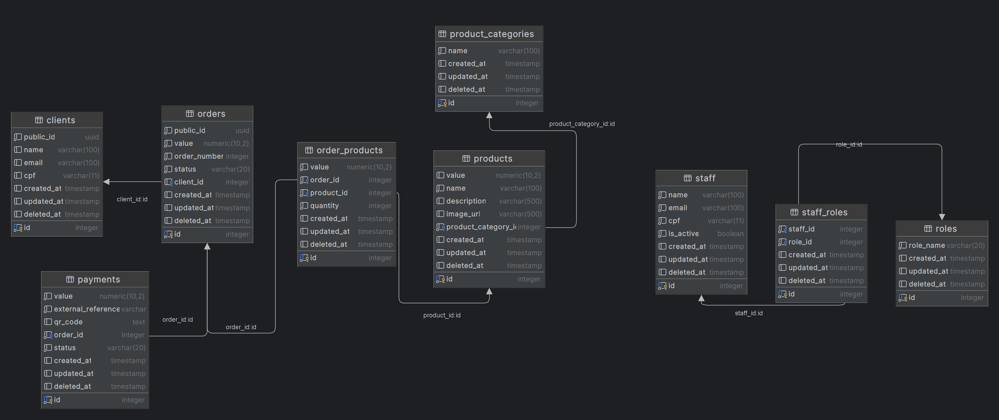
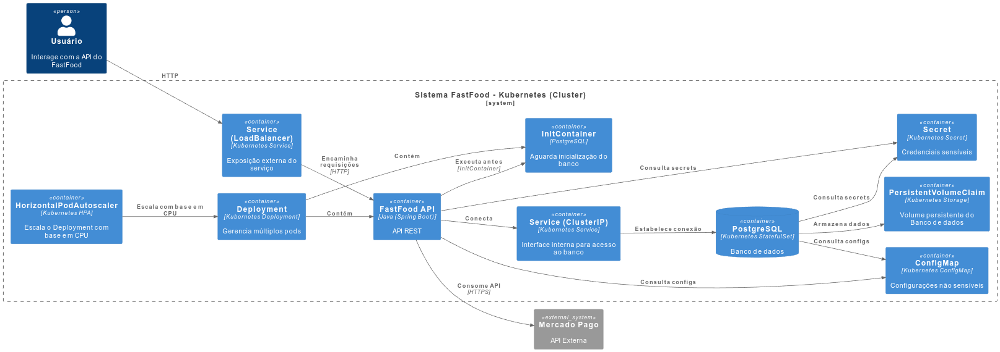

# 📦 FastFood API

Este projeto é uma API RESTful para um sistema de pedidos de fast food, desenvolvida em Java com Spring Boot. A aplicação utiliza PostgreSQL como banco de dados e segue os princípios da Clean Architecture.

## 🚀 Formas de Deploy

A aplicação pode ser executada de diversas formas. Confira abaixo as opções disponíveis e a documentação detalhada para cada uma:

- [📄 Deploy com Docker](./docs/docker.md)
- [📄 Deploy com Kubernetes](./docs/kubernetes.md)

## 🧪 Testes

### ✅ Testes Unitários

Execute os testes unitários com o seguinte comando:

```bash
./gradlew test
```

### 🔁 Testes de Integração

Execute os testes de integração com o seguinte comando:

```bash
./gradlew testIntegration
```

Mais detalhes em: [📄 Documentação de Testes de Integração](./docs/integration-tests.md)

## 📚 Swagger

A documentação da API está disponível via Swagger, acessível em:

```
http://localhost:8080/api/swagger-ui/index.html
```

## 🗃️ Diagrama do Banco de Dados



- [🔗 Acessar diagrama interativo](https://dbdiagram.io/d/FIAP-HEX-68101c011ca52373f5ba7756)

## 🧭 Diagrama DDD

- [🖼️ Visualizar Diagrama DDD (arquivo Draw.io)](./docs/diagrama-ddd.drawio)
- [🔗 Acessar no Google Drive](https://drive.google.com/file/d/1jAH0o1r2prv5UD3AY6mZ57Uc93uPAPi9/view?usp=sharing)

## ☁️ Arquitetura com Kubernetes



Essa imagem foi gerada utilizando o PlantUML. Você pode visualizar o código fonte do diagrama:
- [📄 Arquivo PlantUML](./docs/arquitetura-solucao.puml)


## 🧪 Teste Local

Para gerar um token de autenticação, envie a seguinte identificação no endpoint `/auths`:

```json
{
  "identification": "12345678901"
}
```
